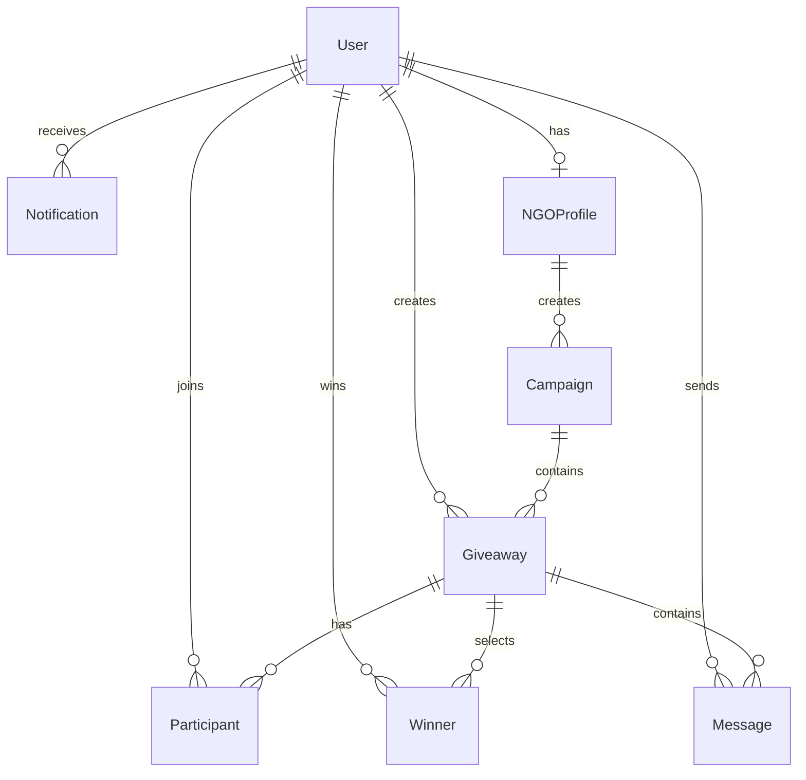

# PEPO Architecture Documentation 🏗️

Technical architecture and design decisions for PEPO platform.

## System Architecture

```
┌─────────────────────────────────────────────────────────────────┐
│                         CLIENT LAYER                            │
├────────────────┬────────────────────┬──────────────────────────┤
│   Web App      │   Mobile App       │   Admin Panel            │
│   (Next.js)    │   (React Native)   │   (Next.js)             │
│   Port: 3000   │   (Expo)           │   Port: 3001            │
└────────┬───────┴────────┬───────────┴────────┬─────────────────┘
         │                │                    │
         └────────────────┴────────────────────┘
                          │
                 ┌────────▼──────────┐
                 │    API Gateway     │
                 │   (NestJS)         │
                 │   Port: 4000       │
                 └────────┬───────────┘
                          │
         ┌────────────────┼────────────────┐
         │                │                │
    ┌────▼─────┐    ┌────▼─────┐    ┌───▼────┐
    │PostgreSQL│    │  Redis   │    │Cloudinary│
    │Database  │    │  Cache   │    │ Images  │
    │Port: 5432│    │Port: 6379│    │         │
    └──────────┘    └──────────┘    └─────────┘
```

## Technology Stack

### Frontend
- **Web**: Next.js 14, React 18, Tailwind CSS, Framer Motion
- **Mobile**: React Native (Expo), NativeWind
- **Admin**: Next.js 14, Recharts
- **State**: Zustand
- **API Client**: Axios

### Backend
- **Framework**: NestJS (Node.js)
- **Language**: TypeScript
- **Database**: PostgreSQL 16
- **ORM**: Prisma
- **Cache**: Redis 7
- **Storage**: Cloudinary
- **Auth**: JWT, Passport

### Infrastructure
- **Containerization**: Docker
- **Monorepo**: npm workspaces + Turbo
- **CI/CD**: GitHub Actions
- **Deployment**: Railway/Vercel/EAS

## Database Schema

### Core Entities



### User Model
```typescript
{
  id: UUID
  email: String (unique)
  passwordHash: String
  name: String
  avatar: String?
  city: String?
  gender: Gender (encrypted, never public)
  role: UserRole (USER | NGO | ADMIN)
  isActive: Boolean
  createdAt: DateTime
}
```

### Giveaway Model
```typescript
{
  id: UUID
  userId: UUID (foreign key)
  title: String
  description: String
  images: String[]
  category: String?
  location: String
  eligibilityGender: EligibilityGender
  quantity: Int
  status: GiveawayStatus
  publishedAt: DateTime?
  closedAt: DateTime?
  drawCompletedAt: DateTime?
}
```

## Core Features Architecture

### 1. Random Draw System ⭐

**The most critical feature** - fair and transparent winner selection.

```typescript
// Flow:
1. User clicks "Close Draw & Pick Winner"
2. Acquire distributed lock (Redis)
3. Validate giveaway status
4. Filter eligible participants
5. Generate cryptographically secure random numbers
6. Select winner(s)
7. Create immutable winner records
8. Update participant statuses
9. Send notifications
10. Release lock
```

**Security:**
- Uses `crypto.randomBytes()` for true randomness
- Distributed locking prevents race conditions
- Atomic database transactions
- Complete audit trail
- Immutable winner records

### 2. Authentication Flow

```
┌─────────┐
│ Client  │
└────┬────┘
     │ 1. Login Request
     ▼
┌─────────────┐
│   Backend   │
└─────┬───────┘
      │ 2. Validate Credentials
      │ 3. Generate JWT
      ▼
┌─────────────┐
│   Redis     │ 4. Store Session
└─────┬───────┘
      │
      │ 5. Return Token
      ▼
┌─────────────┐
│   Client    │ 6. Store Token
└─────────────┘
```

**Methods:**
- Email + OTP (6-digit code)
- Email + Password (bcrypt hashing)
- Google OAuth 2.0
- Apple Sign In (mobile)

### 3. Image Upload Pipeline

```
Client → API → Cloudinary → CDN
          ↓
      Database
    (store URL)
```

**Processing:**
- Max size: 1200x1200
- Auto quality optimization
- Auto format selection (WebP, JPEG)
- CDN delivery

### 4. Messaging System

**Rules:**
- Only enabled after winner selection
- Giver ↔ Winner communication only
- No group messaging
- Read receipts
- Push notifications

### 5. NGO Mode

**Special Features:**
- Verification workflow
- Bulk giveaway management
- Campaign system
- Scheduled distributions
- Impact tracking
- QR code generation

## API Architecture

### RESTful Endpoints

```
/api/auth/*          - Authentication
/api/users/*         - User management
/api/giveaways/*     - Giveaway CRUD
/api/draw/*          - Random draw system
/api/messages/*      - Messaging
/api/notifications/* - Notifications
/api/ngo/*           - NGO features
/api/admin/*         - Admin panel
```

### Request Flow

```
Client Request
     ↓
[Rate Limiter]
     ↓
[Authentication] (JWT)
     ↓
[Authorization] (RBAC)
     ↓
[Validation] (class-validator)
     ↓
[Controller]
     ↓
[Service]
     ↓
[Database/Cache]
     ↓
[Response]
```

## Security Architecture

### Authentication
- JWT tokens (7-day expiry)
- Secure HTTP-only cookies (web)
- Refresh token rotation
- Password hashing (bcrypt, 10 rounds)

### Authorization
- Role-Based Access Control (RBAC)
- Route guards
- Resource ownership checks

### Data Protection
- Gender stored encrypted
- Never exposed publicly
- Used only for eligibility checks
- HTTPS/TLS in production
- Input sanitization
- SQL injection protection (Prisma)

### Rate Limiting
- 10 requests per minute per IP
- Separate limits for different endpoints
- Redis-based tracking

## Caching Strategy

### Redis Cache

**What we cache:**
- User sessions
- Draw locks (critical)
- API responses (short TTL)
- Notification counts

**Cache Invalidation:**
- On data updates
- Time-based expiry
- Pattern-based deletion

## Performance Optimizations

### Database
- Indexes on frequently queried fields
- Connection pooling
- Query optimization with Prisma
- Efficient pagination

### Frontend
- Code splitting
- Image optimization (Cloudinary)
- Lazy loading
- Server-side rendering (Next.js)
- Static generation where possible

### API
- Response compression
- Efficient serialization
- Batched database queries
- N+1 query prevention

## Monitoring & Observability

### Logging
- Structured logging
- Request/response logging
- Error tracking
- Audit logs for critical actions

### Metrics
- API response times
- Database query times
- Cache hit rates
- Error rates

### Alerts
- High error rates
- Slow response times
- Database connection issues
- Redis failures

## Scalability Considerations

### Horizontal Scaling
- Stateless API servers
- Load balancing
- Database read replicas
- Redis Cluster

### Vertical Scaling
- Resource optimization
- Database tuning
- Connection pooling

## Design Patterns

### Backend
- **Repository Pattern**: Data access abstraction
- **Service Layer**: Business logic separation
- **DTO Pattern**: Data validation and transformation
- **Dependency Injection**: Loose coupling

### Frontend
- **Component Composition**: Reusable UI components
- **Custom Hooks**: Reusable logic
- **Context API**: Global state (minimal use)
- **Atomic Design**: Component hierarchy

## Error Handling

### API Errors
```typescript
{
  statusCode: number,
  message: string,
  error?: string,
  timestamp: string,
  path: string
}
```

### Client-Side
- User-friendly error messages
- Retry mechanisms
- Offline detection
- Fallback UI

## Testing Strategy

### Unit Tests
- Service methods
- Utility functions
- Component logic

### Integration Tests
- API endpoints
- Database operations
- Authentication flow

### E2E Tests
- Critical user flows
- Draw system
- Authentication
- Messaging

## Deployment Pipeline

```
Git Push → GitHub Actions → Tests → Build → Deploy
                               ↓
                          Docker Images
                               ↓
                    ┌──────────┴─────────┐
                    ↓                    ↓
              Railway/Render         Vercel
              (Backend)             (Frontend)
```

## Future Enhancements

### Planned Features
- GraphQL API (optional)
- WebSocket for real-time updates
- Elasticsearch for advanced search
- Machine learning for recommendations
- Video uploads
- Multi-language support

### Technical Debt
- Increase test coverage (target: 80%)
- Performance profiling
- Security audit
- Accessibility audit

---

**Last Updated**: December 2024


